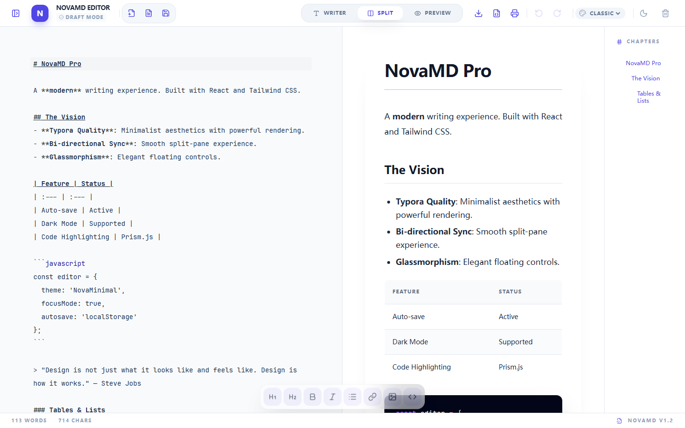

# NovaMD

NovaMD is a modern local-first Markdown editor built with React, Vite, Tailwind CSS, and CodeMirror. It focuses on a clean writing experience, live preview, local file workflows, and themeable reading styles.



## Features

- Live Markdown editing with split, writer, and preview modes
- GitHub Flavored Markdown support, including tables and task-friendly formatting
- Syntax-highlighted code blocks
- Multi-document panel for switching between opened files
- Open local Markdown/Text files with file picker or drag and drop
- Save to disk when browser support is available, with download fallback
- Export Markdown, HTML, and print-to-PDF
- Table of contents with quick jump navigation
- Light/dark mode plus multiple theme presets
- Keyboard shortcuts for common editing and save actions

## Browser Support

NovaMD runs as a client-side web app. Opening files works in modern browsers through standard file inputs.

Saving behavior depends on browser support:

- Chrome and Edge support the File System Access API for choosing a save path.
- Other browsers may fall back to downloading a Markdown file.

## Getting Started

### Prerequisites

- Node.js 20 or newer is recommended.
- npm, included with Node.js.

### Install

```bash
npm install
```

### Develop

```bash
npm run dev
```

The app is served at:

```text
http://localhost:3000
```

### Type Check

```bash
npm run lint
```

### Build

```bash
npm run build
```

### Preview Production Build

```bash
npm run preview
```

## Deploy to GitHub Pages

NovaMD is a static Vite app, so it can be hosted directly on GitHub Pages.

### Option 1: Deploy with GitHub Actions

Create `.github/workflows/deploy.yml`:

```yaml
name: Deploy to GitHub Pages

on:
  push:
    branches: [main]
  workflow_dispatch:

permissions:
  contents: read
  pages: write
  id-token: write

concurrency:
  group: pages
  cancel-in-progress: false

jobs:
  build:
    runs-on: ubuntu-latest
    steps:
      - name: Checkout
        uses: actions/checkout@v4

      - name: Setup Node
        uses: actions/setup-node@v4
        with:
          node-version: 20
          cache: npm

      - name: Install dependencies
        run: npm ci

      - name: Build
        run: npm run build

      - name: Upload artifact
        uses: actions/upload-pages-artifact@v3
        with:
          path: dist

  deploy:
    environment:
      name: github-pages
      url: ${{ steps.deployment.outputs.page_url }}
    runs-on: ubuntu-latest
    needs: build
    steps:
      - name: Deploy
        id: deployment
        uses: actions/deploy-pages@v4
```

Then open your repository settings:

1. Go to `Settings` -> `Pages`.
2. Set `Source` to `GitHub Actions`.
3. Push to the `main` branch.

The site will be available at:

```text
https://<your-username>.github.io/<your-repository>/
```

### Option 2: Manual Build

```bash
npm run build
```

Upload the generated `dist/` directory to any static hosting service.

## Project Structure

```text
src/
  components/       Reusable editor, preview, toolbar, and navigation UI
  hooks/            Markdown history state
  lib/              Shared utilities
  App.tsx           Main application shell and document workflow
  index.css         Tailwind setup, themes, and Markdown styling
  main.tsx          React entry point
```

## Keyboard Shortcuts

- `Ctrl/Cmd + O`: Open document
- `Ctrl/Cmd + S`: Save or save as
- `Ctrl/Cmd + B`: Bold
- `Ctrl/Cmd + I`: Italic
- `Ctrl/Cmd + K`: Link
- `Ctrl/Cmd + P`: Print PDF

## Contributing

Issues and pull requests are welcome. For larger changes, please open an issue first so the direction can be discussed.

## License

MIT
